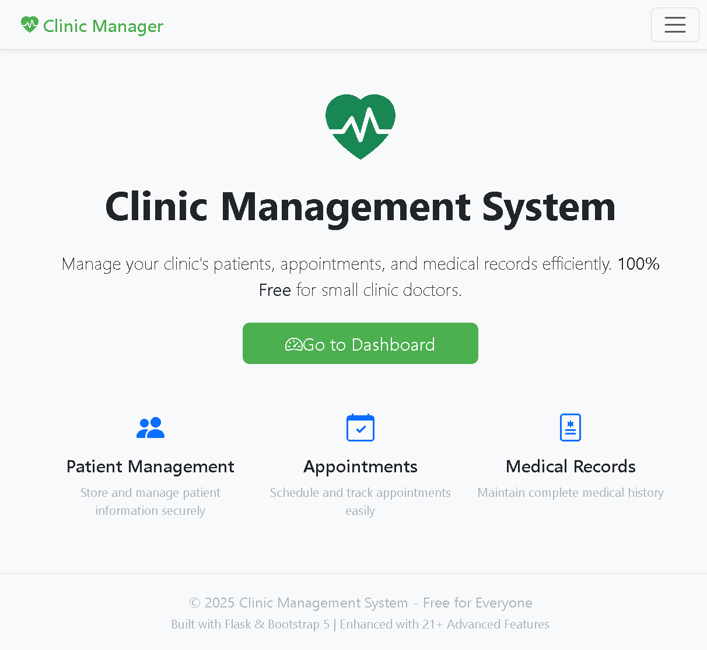

<!DOCTYPE html>
<html lang="en">
<head>
<meta charset="utf-8" />
<meta name="viewport" content="width=device-width,initial-scale=1" />
<title>Vishwas Saini — Python Web Developer</title>
<link href="https://fonts.googleapis.com/css2?family=Poppins:wght@300;400;600;700&display=swap" rel="stylesheet">

</head>
<body>

<!-- Parallax decorative blobs -->

  
  
  

<!-- Magnetic custom cursor -->

<!-- Header -->
<header>
  

    <a class="brand" href="#">
      
VS

      

        
Vishwas Saini

        
Python Web Developer

      

    </a>

    <nav class="nav">
      <a href="#projects">Projects</a>
      <a href="#skills">Skills</a>
      <a href="#contact">Contact</a>
      <a class="iconlink" href="https://vishwassaini.itch.io/" target="_blank" rel="noopener">
        <!-- itch icon simple -->
        <svg width="18" height="18" viewBox="0 0 24 24" fill="none"><path d="M4 7h16M4 13h16M4 19h16" stroke="currentColor" stroke-width="1.6" stroke-linecap="round"/></svg>
        Itch
      </a>
      <a class="iconlink" href="https://www.reddit.com/user/FeelingBullfrog5749/" target="_blank" rel="noopener">
        <svg width="18" height="18" viewBox="0 0 24 24" fill="none"><path d="M6 12a6 6 0 0012 0" stroke="currentColor" stroke-width="1.4" stroke-linecap="round"/></svg>
        Reddit
      </a>
      <button class="smallbtn" onclick="toggleTheme()">Theme</button>
    </nav>
  

</header>

<!-- Cinematic Hero -->
<section class="hero" id="top">
  

    

      <h1>Hi, I’m Vishwas Saini</h1>
      
I build modern, scalable web applications using Python, Flask, PostgreSQL, and AI integrations. I focus on clean architecture, responsive design, smooth user experiences, and delivering high-quality solutions with minimal operational cost.

      

        <a class="btn" href="#projects">View Projects</a>
        <a class="btn" href="https://vishwassaini.itch.io/" target="_blank" style="background:transparent;border:1px solid var(--glass-border;color:var(--text)">Visit Itch</a>
      

      

        

          

            
          

          

            
Clinic Management System

            
Full clinic management, appointments, records, email & AI features

          

        

      

    

    

      <!-- cinematic background comes from the screenshot -->
      
    

  

</section>

<!-- Projects -->
<section id="projects" class="section">
  

    

      <h2 style="margin-bottom:6px">Featured Projects</h2>
      
Selected work — web apps, admin tools, and AI integrations

    

  

  

  

    <button class="filter-btn active" onclick="filter('all', this)">All</button>
    <button class="filter-btn" onclick="filter('web', this)">Web</button>
    <button class="filter-btn" onclick="filter('ai', this)">AI</button>
  

  

    <!-- single featured card (you can duplicate for more projects) -->
    <article class="card" role="listitem" data-tags="web ai">
      

        

          
        

        <h3 style="margin-bottom:6px">Clinic Management Website</h3>
        
A full-featured Clinic Management System designed to help doctors efficiently manage patient information, appointments, records and communications. Integrated with secure authentication, email automation (Brevo), and AI-assisted features for insights and workflow improvements.

        

          <a class="btn" href="https://clinic-management-website.onrender.com/" target="_blank">Live Demo</a>
          <button class="filter-btn" onclick="window.open('https://vishwassaini.itch.io/','_blank')">Buy / Download</button>
          
Tech: Python • Flask • Neon PG • Brevo • Gemini • Mistral

        

      

    </article>
  

</section>

<!-- Skills -->
<section id="skills" class="section center">
  <h2>Skills & Tools</h2>
  
Technologies I use every day

  

    Python
    Flask
    PostgreSQL
    HTML & CSS
    JavaScript
    Bootstrap
    Gemini AI
    Mistral AI
    Render
    Brevo (Email)
  

</section>

<!-- Contact -->
<section id="contact" class="section center">
  <h2>Contact</h2>
  
For project inquiries, custom development, or deployment & hosting packages, email me or message via Reddit / itch.io.

  

    <a class="btn" href="mailto:vissaini744@gmail.com">Email: vissaini744@gmail.com</a>
  

  

    <a class="iconlink" href="https://vishwassaini.itch.io/" target="_blank" rel="noopener noreferrer">Itch.io • vishwassaini</a>
    <a class="iconlink" href="https://www.reddit.com/user/FeelingBullfrog5749/" target="_blank" rel="noopener noreferrer">Reddit • FeelingBullfrog5749</a>
  

</section>

<!-- Modal viewer -->

  

<!-- Footer -->
<footer class="footer">
  
© 2026 Vishwas Saini — Python Web Developer

  
Portfolio • Clinic Management Website • Render & Neon Deployment

</footer>

</body>
</html>
