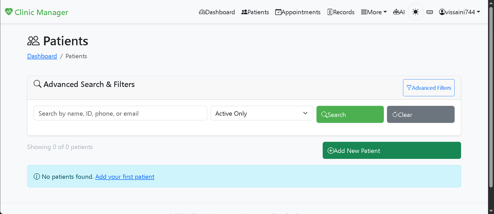
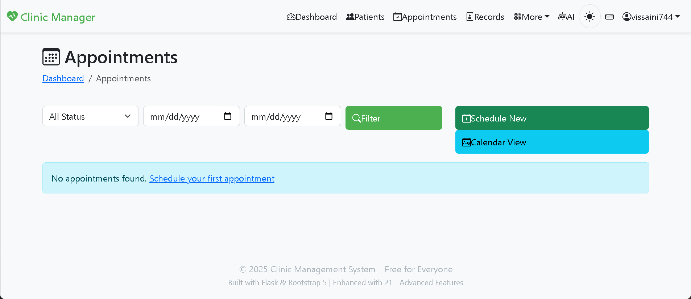
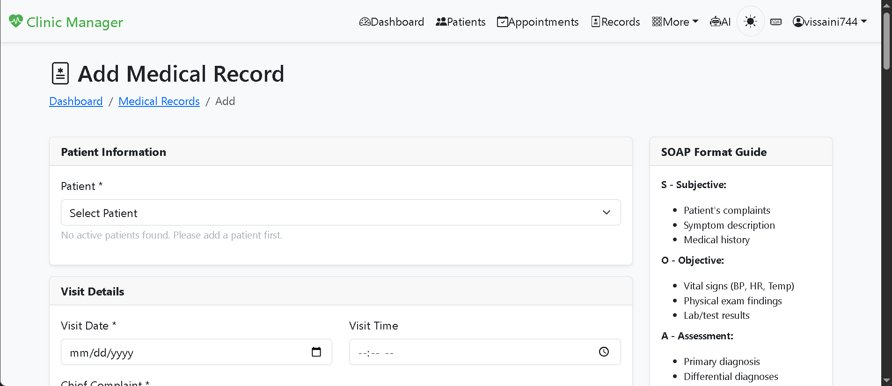
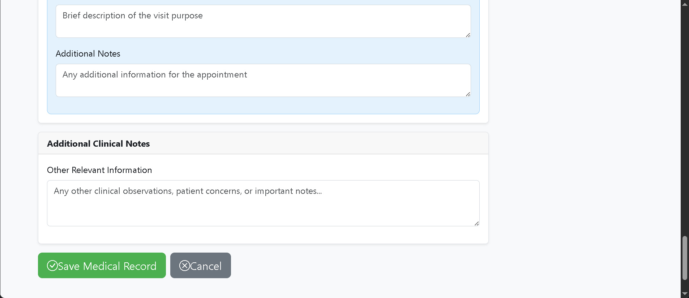

<!DOCTYPE html>
<html lang="en">
<head>
<meta charset="UTF-8">
<meta name="viewport" content="width=device-width, initial-scale=1.0">
<title>Vishwas Saini | Python Web Developer</title>

<link href="https://fonts.googleapis.com/css2?family=Poppins:wght@300;400;600;700&display=swap" rel="stylesheet">

</head>

<body>

<header>
<nav>
  <strong>Vishwas Saini</strong>
  
☰

  

    <a href="#projects">Projects</a>
    <a href="#skills">Skills</a>
    <a href="#contact">Contact</a>
    🌙
  

</nav>
</header>

<section class="hero">
<h1>Hi, I’m Vishwas Saini</h1>
<h2>Python Web Developer</h2>

I build modern, scalable web applications using Python, Flask, PostgreSQL, and AI integrations.
I focus on clean architecture, responsive design, smooth user experiences, and delivering
high-quality solutions with minimal operational cost.

<a class="btn" href="#projects">View My Work</a>
</section>

<section id="projects">
<h2>Projects</h2> 

<button class="filter-btn active" onclick="filterProjects('all',this)">All</button>
<button class="filter-btn" onclick="filterProjects('web',this)">Web</button>
<button class="filter-btn" onclick="filterProjects('ai',this)">AI</button>

<h3>Clinic Management Website</h3>

A full-featured clinic management system enabling doctors to manage patient records,
appointments, communication, and AI-powered workflows efficiently.

<a class="btn" target="_blank" href="https://clinic-management-website.onrender.com/">Live Demo</a>

</section>

<section id="skills">
<h2>Skills & Tools</h2> 

Python
Flask
PostgreSQL
HTML
CSS
JavaScript
Gemini AI
Mistral AI
Render
Email APIs

</section>

<section id="contact">
<h2>Contact</h2> 

Email: <a href="mailto:vissaini744@gmail.com">vissaini744@gmail.com</a>

</section>

<footer>© 2026 Vishwas Saini</footer>

</body>
</html>
